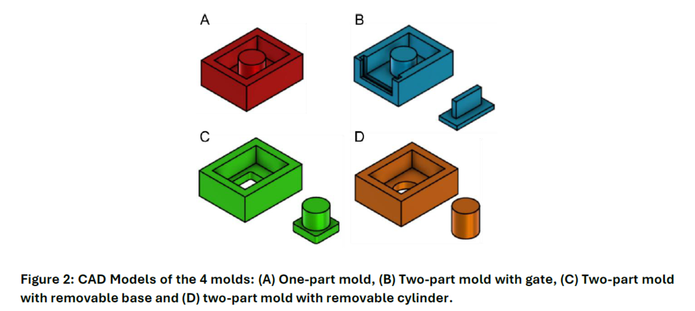

# PDMS Well Mold Designs — OpenSCAD Parametric Models

Parametric 3D-printable mold designs for casting **PDMS (Polydimethylsiloxane) wells** used in cell biology, microfluidics, and lab-on-a-chip experiments. All files are built in [OpenSCAD](https://openscad.org/) so that any dimension can be changed by editing a single variable — no CAD experience needed.

---

## Who Is This For?

Researchers who need custom PDMS chambers for cell biology, microfluidics, or live-cell imaging experiments, but do not have CAD design experience. All dimensions are exposed as plain variables at the top of each file — adapting a design to your experiment requires no knowledge of 3D modeling.

> A detailed design flow describing the full fabrication workflow is currently under review for publication. This section will be updated with the reference once available.

---

## Repository Contents

| File                           | Description                                                            |
| ------------------------------ | ---------------------------------------------------------------------- |
| `Well.scad`                    | The final PDMS well — the part you cast                                |
| `Lid.scad`                     | Snap-fit lid with alignment pegs for the well                          |
| `One part mold.scad`           | **(Design A)** Simplest mold — single piece, print-and-use             |
| `Removable gate mold.scad`     | **(Design B)** Two-part mold with a sliding gate insert                |
| `Removable base mold.scad`     | **(Design C)** Two-part mold with a removable base peg                 |
| `Removable cylinder mold.scad` | **(Design D)** Scaled-up two-part mold with a large removable cylinder |

---

## Mold Designs



*Figure: CAD Models of the 4 molds — (A) One-part mold, (B) Two-part mold with gate, (C) Two-part mold with removable base, (D) Two-part mold with removable cylinder.*

---

### A — One-Part Mold (`One part mold.scad`)

The simplest design. The entire mold is a single printed piece. The cylindrical post that forms the well opening is part of the body — nothing to assemble before pouring.

**Default dimensions:**
- Inner cavity: 20 × 15 × 7 mm
- Well hole diameter: 7 mm
- Wall thickness: 2 mm

**Demolding:** Flex the mold walls outward and pull the cured PDMS straight up. Because the cylinder is built-in, this requires more force than the two-part options.

---

### B — Two-Part Mold with Gate (`Removable gate mold.scad`)

The mold body has a slot on one side into which a thin **gate** (a flat sliding insert with a small handle) is inserted after the cylinder is placed. The gate closes the side opening and creates a clean edge on the cured well.

**Default dimensions:**
- Inner cavity: 20 × 15 × 7 mm
- Well hole diameter: 9 mm
- Wall thickness: 2 mm
- Gate handle height: 5 mm

**Assembly:** Place the gate into the slot before pouring PDMS. After curing, remove the gate first, then peel the PDMS well out.

---

### C — Two-Part Mold with Removable Base (`Removable base mold.scad`)

The cylinder that forms the well opening is a separate **peg** that locks into a square socket in the mold floor. 

**Default dimensions:**
- Inner cavity: 20 × 15 × 7 mm
- Well hole diameter: 7.5 mm
- Wall thickness: 3 mm
- Peg-to-socket tolerance: 0.1 mm

**Assembly:** Snap the peg into the floor socket, pour PDMS. After curing, pull the peg out first, then flex the mold walls to release the well.

---

### D — Two-Part Mold with Removable Cylinder (`Removable cylinder mold.scad`)

A scaled-up version where the entire cylindrical insert — rather than just a small peg — is a separate printed piece. The cylinder slides into a hole in the mold floor.

**Default dimensions:**
- Inner cavity: 50 × 40 × 25 mm
- Well hole diameter: 17.5 mm
- Wall thickness: 5 mm
- Cylinder-to-hole tolerance: 0.25 mm

**Assembly:** Insert the cylinder through the floor hole, pour PDMS. After curing, push the cylinder down and out through the floor, then peel out the PDMS well.

---

### Well (`Well.scad`) and Lid (`Lid.scad`)

`Well.scad` is the reference model of the final casted part (20 × 15 × 7 mm, 7 mm hole). Use it for reference or to verify fit before printing a mold.

`Lid.scad` is a snap-on lid for the cured well. It has a 0.5 mm clearance gap around the perimeter and four small alignment pegs on the inner rim that hold it in place on top of the well.

---

## Customizing Dimensions

Each file declares all dimensions as variables at the very top. Open any `.scad` file in a text editor or in OpenSCAD's built-in editor and change the values to fit your experiment:

```openscad
l = 20;         // inner length of the well (mm)
w = 15;         // inner width of the well (mm)
h = 7;          // inner height / depth of the well (mm)
diameter = 7;   // diameter of the well opening (mm)
t = 2;          // mold wall thickness (mm)
tolerance = 0.1; // clearance between interlocking parts (mm)
```

After editing, press **F5** in OpenSCAD to preview or **F6** to do a full render and verify the geometry before exporting.

> **Tip on tolerance:** If the removable peg or cylinder is too tight to insert, increase `tolerance` by 0.05 mm and re-print. If it is too loose, decrease it.

---

## Generating STL Files

Open the `.scad` file in [OpenSCAD](https://openscad.org/downloads.html), render the model, and export it as STL. The STL can then be opened in any slicer (Cura, PrusaSlicer, Bambu Studio) and sent to a 3D printer.

---

## License

These designs are released for free academic and research use. If you use them in a publication, please consider citing this repository.

---

## Contributing

Pull requests are welcome. If you adapt one of these molds for a different well geometry, consider sharing the modified `.scad` file so others can benefit from it.
